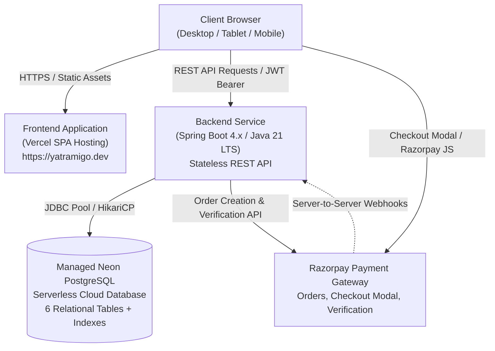

<h1 align="center">
  Yatramigo — Travel Booking Web Application
</h1>

<p align="center">
  <strong>A modern, full-stack travel booking and tour management platform built with React 19, Spring Boot, PostgreSQL, JWT authentication, and Razorpay INR payments.</strong>
</p>

<p align="center">
  <a href="https://yatramigo.dev/"></a>
  
  
  
  
  
  
</p>

---

## 🌐 Live Demo

- **Primary Custom Domain**: [https://yatramigo.dev/](https://yatramigo.dev/)
- **Vercel Production Mirror**: [https://travel-booking-web.vercel.app](https://travel-booking-web.vercel.app)

---

## 📖 Overview

**Yatramigo** is an enterprise-grade, full-stack travel booking web application designed to deliver an intuitive travel discovery, seat reservation, and digital payment experience. Built with a **Java 21 / Spring Boot** REST API backend and a responsive **React 19 / Vite** frontend, the platform enforces strict security, zero-trust financial calculations, real-time inventory management, and automated reservation lifecycles.

---

## ✨ Features

### 👤 Traveler Experience (`USER` Role)
- **Destination & Tour Catalog**: Explore curated travel packages across premier destinations with keyword search, destination filters, and price/duration sorting.
- **Dynamic Tour Details**: Live seat inventory counters, interactive cost calculators based on guest count, inclusions/exclusions, and daily itineraries.
- **Seat Reservation & Hold System**: Reserve seats with atomic inventory decrements and automatic 15-minute expiration timers for pending reservations.
- **Razorpay INR Payment Gateway**: Seamless payment checkout supporting UPI, Credit/Debit Cards, Net Banking, and Wallets in Indian Rupees (`₹`).
- **Cryptographic Signature Verification**: Instant verification of Razorpay payment signatures using backend HMAC-SHA256.
- **Booking & Receipt Center**: View active and completed bookings, download digital transaction receipts, update reservation dates, or cancel reservations (returning seats to the pool).
- **Verified Traveler Reviews**: Submit, edit, and delete 1–5 star ratings and reviews for packages after booking.

### 🏢 Administrator Portal (`ADMIN` Role)
- **Metrics Dashboard**: Real-time KPI summaries covering total packages, active destinations, registered travelers, and gross booking revenue.
- **Package Management (CRUD)**: Create new packages with rich descriptions, price per person, duration, total capacity, and destination association; update or archive existing packages.
- **Destination Management (CRUD)**: Create, edit, and manage travel regions and countries.
- **Booking Management**: System-wide view of all customer bookings with status filtering (`PENDING_PAYMENT`, `CONFIRMED`, `CANCELLED`, `EXPIRED`).
- **Payment Audit Log**: Comprehensive financial records detailing Razorpay order IDs, payment IDs, amounts, methods, and timestamps.
- **Review Moderation**: Audit and moderate traveler reviews across all packages.

---

## 🏗️ System Architecture



---

## 🛠️ Technology Stack

| Layer | Technologies |
|---|---|
| **Frontend** | React 19, Vite 8, React Router v7, Axios, Lucide React, Custom CSS Design System |
| **Backend** | Java 21 LTS, Spring Boot 3.4 / 4.x, Spring Data JPA, Spring Security |
| **Security & Auth** | JSON Web Tokens (JJWT 0.12.6), BCrypt Password Hashing, RBAC Filter Chain |
| **Payments** | Razorpay Java SDK 1.4.3, HMAC-SHA256 Signature Verification, INR (`₹`) Currency |
| **Database** | PostgreSQL 14+, Neon Serverless PostgreSQL (Production), HikariCP Pool |
| **Scheduled Tasks** | Spring `@Scheduled` background worker for 15-minute booking expiration |
| **Deployment** | Vercel (Frontend SPA), Cloud Container / Docker (Backend API), Neon (Database) |

---

## 📁 Project Structure

```text
travelBookingWeb/
├── frontend/                               # React 19 + Vite 8 SPA
│   ├── src/
│   │   ├── components/
│   │   │   ├── admin/                      # Admin modals and package forms
│   │   │   ├── common/                     # Navbar, Footer, Modal, LoadingSpinner
│   │   │   ├── packages/                   # Package filters, travel package cards
│   │   │   ├── payments/                   # Payment checkout forms, status badges
│   │   │   └── reviews/                    # Star ratings, review cards, review forms
│   │   ├── context/                        # AuthContext, ToastContext
│   │   ├── layouts/                        # MainLayout, DashboardLayout, AdminLayout
│   │   ├── pages/                          # Home, Packages, Booking, Payments, Admin
│   │   ├── routes/                         # AppRoutes, ProtectedRoute, AdminRoute
│   │   ├── services/                       # Axios API service clients (auth, booking, payment, etc.)
│   │   └── utils/                          # Currency formatters, Razorpay loader
│   ├── vercel.json                         # SPA routing rewrite rule (/* -> /index.html)
│   └── vite.config.js                      # Vite build configuration with chunk optimization
├── src/
│   ├── main/
│   │   ├── java/org/telusco/travelbookingweb/
│   │   │   ├── config/                     # SecurityConfig (CORS, JWT filter), RazorpayConfig
│   │   │   ├── controller/                 # REST controllers (Travel, Booking, Payment, Admin, Review)
│   │   │   ├── dto/                        # Request and response data transfer objects
│   │   │   ├── entity/                     # JPA Entities (User, Destination, TravelPackage, Booking, Payment, Review)
│   │   │   ├── exception/                  # Custom exceptions & GlobalExceptionHandler
│   │   │   ├── repository/                 # Spring Data JPA repositories
│   │   │   ├── scheduler/                  # BookingExpirationScheduler (cron task)
│   │   │   ├── security/                   # JwtAuthenticationFilter
│   │   │   └── service/                    # Business services (Payment, Booking, Razorpay, Auth, etc.)
│   │   └── resources/
│   │       ├── application.properties      # Base Spring Boot configuration
│   │       ├── application-prod.properties # Production profile (HikariCP, strict CORS, env overrides)
│   │       └── schema.sql                  # PostgreSQL table definitions and performance indexes
│   └── test/java/                          # 39 Unit & End-to-End Integration Tests
├── Dockerfile                              # Multi-stage production container build (Java 21 LTS)
├── DEPLOYMENT.md                           # Complete production deployment & operations guide
├── .env.example                            # Backend environment variable template
└── pom.xml                                 # Maven dependency and build configuration
```

---

## 🗺️ Core Modules & API Overview

### 1. Authentication & Users (`/api/users`)
- `POST /api/users/register` — Register a new traveler account.
- `POST /api/users/login` — Authenticate credentials and receive a signed JWT token.
- `GET /api/users/me` — Retrieve authenticated user profile and role.

### 2. Destinations & Packages (`/api/destinations`, `/api/travel-packages`)
- `GET /api/destinations` — List all travel destinations.
- `GET /api/travel-packages` — List packages with optional destination filtering, keyword search, and sorting.
- `GET /api/travel-packages/{id}` — Retrieve detailed package metadata, pricing, and live seat availability.

### 3. Bookings (`/api/bookings`)
- `POST /api/bookings` — Create a reservation (atomically decrements seat pool; sets status to `PENDING_PAYMENT` with a 15-minute expiration window).
- `GET /api/bookings/my-bookings` — Retrieve the authenticated traveler's reservation history.
- `GET /api/bookings/{id}` — Get single booking details.
- `PUT /api/bookings/{id}` — Update reservation travel date or party size (for unpaid bookings).
- `DELETE /api/bookings/{id}` — Cancel reservation and immediately restore reserved seats to general availability.

### 4. Payments (`/api/payments`)
- `POST /api/payments/razorpay/create-order` — Create a Razorpay order. The backend calculates the authoritative price in paise from the database.
- `POST /api/payments/razorpay/verify` — Cryptographically verify Razorpay HMAC signature (`order_id|payment_id`). On success, transitions payment to `SUCCESS` and booking to `CONFIRMED`.
- `GET /api/payments/my-payments` — List payment receipts for the logged-in user.
- `POST /api/payments/webhook` — Secure server-to-server webhook handler for asynchronous payment capture notifications.

### 5. Reviews (`/api/reviews`)
- `GET /api/reviews/package/{packageId}` — Retrieve verified traveler reviews and ratings for a package.
- `POST /api/reviews` — Submit a rating (1–5) and review comment.
- `PUT /api/reviews/{id}` — Edit an existing review.
- `DELETE /api/reviews/{id}` — Remove a review.

### 6. Administration (`/api/admin`)
- `GET /api/admin/metrics` — Retrieve global system statistics.
- `POST /api/admin/travel-packages` — Create a new travel package.
- `PUT /api/admin/travel-packages/{id}` — Update an existing travel package.
- `DELETE /api/admin/travel-packages/{id}` — Archive or delete a package.
- `GET /api/admin/bookings` — Access system-wide reservations.
- `GET /api/admin/payments` — Review all financial transactions.

---

## 🗄️ Database Architecture

The relational schema is defined in [schema.sql](file:///Users/ektagarg/javaspring/travelBookingWeb/src/main/resources/schema.sql) and runs on PostgreSQL 14+:

| Table | Purpose | Key Constraints |
|---|---|---|
| `app_users` | Registered users and administrators | `email UNIQUE`, `role IN ('USER', 'ADMIN')` |
| `destination` | Geographic travel regions | Primary key `id` |
| `travel_package` | Tour itineraries and capacities | FK to `destination(id)`, `price`, `available_seats` |
| `booking` | Traveler reservations | FK to `travel_package(id)`, FK to `app_users(id)`, `expires_at` |
| `payment` | Financial transaction audit trail | FK to `booking(id)`, `razorpay_order_id`, `razorpay_payment_id` |
| `review` | Customer ratings and comments | FK to `travel_package(id)`, FK to `app_users(id)` |

*Performance indexes are established on `booking(user_id)`, `booking(status, expires_at)`, `payment(booking_id)`, `payment(razorpay_order_id)`, and foreign keys.*

---

## 🔒 Security Architecture

1. **Stateless JWT Authentication**: Passwords hashed with BCrypt. Signed tokens transmitted via `Authorization: Bearer <token>` header with role-based claim verification.
2. **Zero-Trust Financial Architecture**: The frontend never dictates payment amounts. The backend queries the database for the authoritative package price, calculates the exact sum with `BigDecimal`, and creates the Razorpay order in paise (`amount * 100`).
3. **Cryptographic HMAC-SHA256 Verification**: Payments are confirmed only after verifying the digital signature `HMAC_SHA256(order_id + "|" + payment_id, KEY_SECRET)`.
4. **Replay & Tamper Defense**: Unique constraint and verification logic prevents duplicate submissions of previously captured Razorpay payment IDs.
5. **CORS Whitelisting**: Strict origin isolation configured in Spring Security (`SecurityConfig.java`). In production, only the verified frontend origin (`https://yatramigo.dev`) is permitted.
6. **Encrypted Cloud Database**: All production database connections require SSL (`sslmode=require`).
7. **Zero Credentials in Git**: All sensitive values (database passwords, JWT secrets, Razorpay private keys) are supplied exclusively via environment variables.

---

## ⚙️ Environment Variables

Backend and frontend templates are provided in `.env.example` and `frontend/.env.example`.

### Backend Environment Variables (`application-prod.properties`)

| Variable Name | Description |
|---|---|
| `SPRING_PROFILES_ACTIVE` | Set to `prod` to activate the production configuration. |
| `PORT` | Embedded server port (injected automatically by cloud container platforms, default: `8080`). |
| `DATABASE_URL` | Managed PostgreSQL JDBC connection string (`jdbc:postgresql://<host>:<port>/<dbname>?sslmode=require`). |
| `DB_USERNAME` | Database username (if credentials are supplied separately). |
| `DB_PASSWORD` | Database password (if credentials are supplied separately). |
| `JWT_SECRET` | 256-bit cryptographic secret string for JWT signature verification. |
| `FRONTEND_URL` | Production frontend URL for CORS whitelist (e.g. `https://yatramigo.dev`). |
| `RAZORPAY_KEY_ID` | Razorpay public key ID (`rzp_test_...` or `rzp_live_...`). |
| `RAZORPAY_KEY_SECRET` | Razorpay private secret key (**strictly confidential**). |
| `RAZORPAY_WEBHOOK_SECRET` | Secret configured in the Razorpay dashboard for webhook payload validation. |

### Frontend Environment Variables (`frontend/.env.example`)

| Variable Name | Description |
|---|---|
| `VITE_API_BASE_URL` | Public HTTPS URL of the backend REST API (e.g. `https://your-api.onrender.com`). In local dev, leave blank to use the Vite proxy. |

---

## 💻 Local Development

### Prerequisites
- **Java 21 LTS**
- **Node.js 18+** & **npm**
- **PostgreSQL 14+** (running locally or a remote development instance)

### 1. Backend Setup
```bash
# Clone the repository
git clone https://github.com/praveshgarg099/travel-booking-web.git
cd travel-booking-web

# Run all unit and integration tests
./mvnw clean test

# Start the Spring Boot development server (port 8080)
./mvnw spring-boot:run
```

### 2. Frontend Setup
```bash
cd frontend

# Install dependencies
npm install

# Start the Vite development server (port 5173)
npm run dev
```
Open [http://localhost:5173](http://localhost:5173) in your browser.

---

## 🚀 Production Deployment

- **Frontend**: Hosted on [Vercel](https://vercel.com) with root directory set to `frontend`, build command `npm run build`, and output directory `dist`. SPA client-side routing is handled via `vercel.json`.
- **Backend**: Containerized via [Dockerfile](file:///Users/ektagarg/javaspring/travelBookingWeb/Dockerfile) using `eclipse-temurin:21-jre-jammy` and deployed on cloud container infrastructure (e.g., Render, Railway).
- **Database**: Serverless PostgreSQL provisioned via [Neon](https://neon.tech) with encrypted connections (`sslmode=require`).

*For comprehensive step-by-step production instructions, refer to the [Production Deployment Guide](file:///Users/ektagarg/javaspring/travelBookingWeb/DEPLOYMENT.md).*

---

## 🧪 Testing & Quality Assurance

The codebase is validated with comprehensive automated test suites and production build checks:

- **Backend Test Suite**: **39 tests, 0 failures, 0 errors** (`./mvnw clean test`).
  - Unit tests covering booking logic, seat calculation, and inventory releases.
  - End-to-end integration tests validating Razorpay order creation and HMAC signature verification.
  - Role-based authorization tests enforcing admin vs. customer endpoint boundaries.
  - Booking expiration scheduler tests validating automated release of expired seats.
- **Frontend Production Build**: Clean Vite 8 production build (`npm run build`) with zero errors, zero chunk warnings, and minified bundles.

---

## 🛡️ Security Notice

> [!CAUTION]
> **Credential Hygiene**: Never commit `.env` files, production API keys, database passwords, JWT secrets, or Razorpay secret keys to Git. All credentials must be managed strictly through host environment variables or secret management services.

---

## 📝 License

This project is open-source and available under the standard MIT License for educational, personal, and professional portfolio demonstration purposes.
